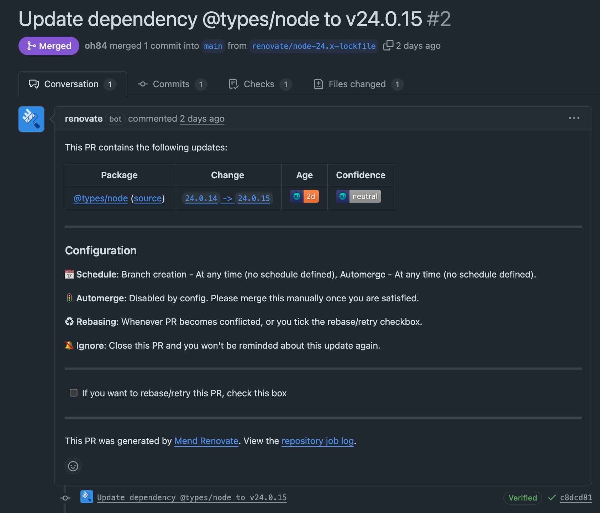
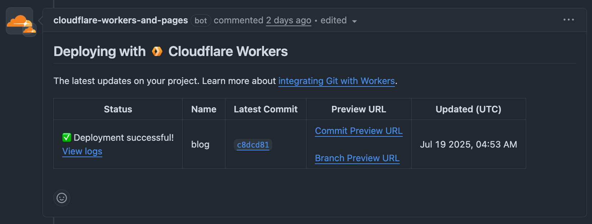

Astro というフレームワークでブログを作って Cloudflare Workers にデプロイしてみました。  

Cloudflare の公式ドキュメントを参考にプロジェクトを作成。  
https://developers.cloudflare.com/workers/framework-guides/web-apps/astro/

```shell
mkdir blog
cd blog
npm create cloudflare@latest -- . --framework=astro
```

Astro のテンプレートを選択するように求められたので blog テンプレートを選びました。  
https://github.com/withastro/astro/tree/main/examples/blog

起動してみたところ画像がうまく表示できていなかったので、 `astro.config.mjs` の `imageService` を `compile` に変更しました。
少しだけ調べた感じだとコンテンツの量が増えたときにビルド時間が長くなる可能性はありそうだったのですが、表示できたので一旦これでよしとしました。
https://docs.astro.build/ja/guides/integrations-guide/cloudflare/#imageservice

```diff
export default defineConfig({
  ...
  adapter: cloudflare({
    ...
-   imageService: "cloudflare"
+   imageService: "compile"
  }),
});
```

あとは [Renovate](https://www.mend.io/mend-renovate/) を設定してみました。
他のリポジトリで [Dependabot](https://docs.github.com/ja/code-security/dependabot) も使ってみて違いを比べてみたいです。



Cloudflare Workers の GitHub 連携も設定してみました。
簡単に設定でき、プロダクションブランチに変更があると自動でデプロイされるようです。
それ以外のブランチの場合はプレビュー環境にデプロイされるようで、とても便利そうでした。  
https://developers.cloudflare.com/workers/ci-cd/builds/git-integration/



スタイルなどはまだほとんどテンプレートのデフォルトのままなので、今後色々いじっていければと思います。  
