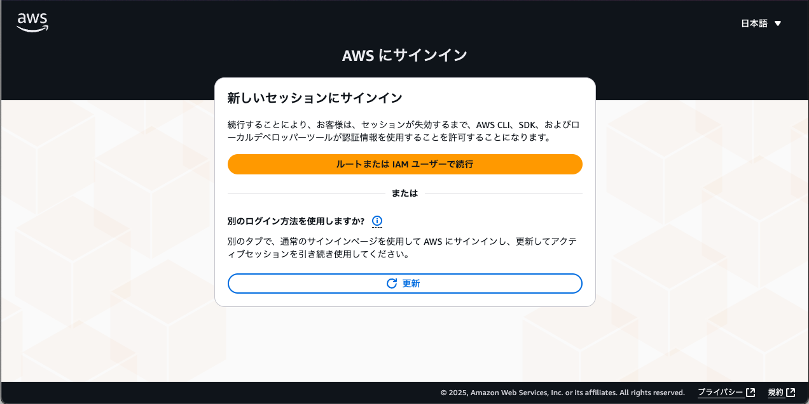
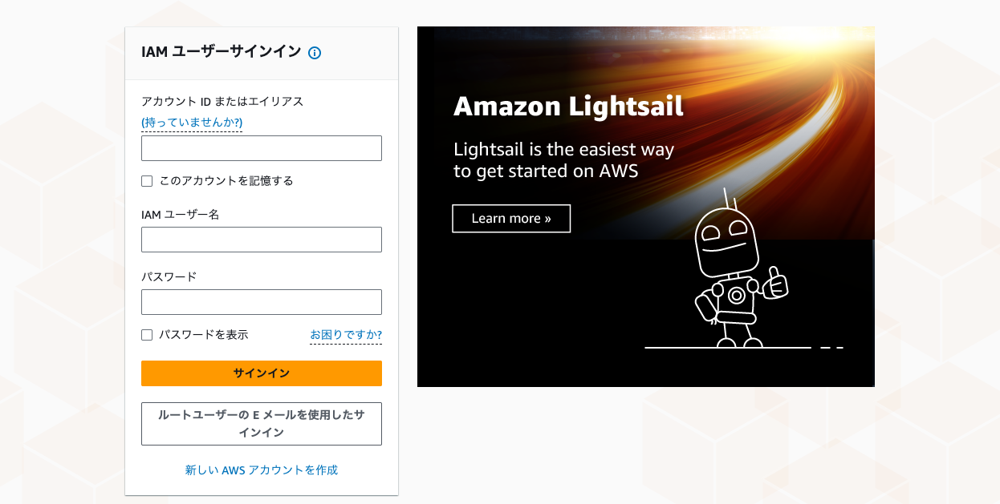
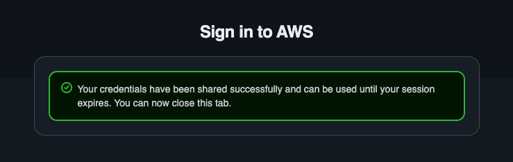

AWS CLIでaws loginコマンドが使えるようになりました。  
<https://aws.amazon.com/jp/blogs/security/simplified-developer-access-to-aws-with-aws-login/>

最近サプライチェーン攻撃の話題をよく耳にするなか、対策の一つとしてAWSアクセスキーなどの機密情報をローカルPCに置かないようにしなければと思っていたのですが、ちょうどこのコマンドが出たのでぴったりのタイミングでした。

## miseで最新のAWS CLIをインストール

元々HomebrewでAWS CLIをインストールしていたのですが、Homebrewではまだ最新バージョンは取得できないようだったので、miseでインストールしました。  
<https://mise.jdx.dev/registry.html#tools>

```console
❯ mise use -g aws-cli@latest

❯ aws --version
aws-cli/2.32.1 Python/3.13.9 Darwin/24.6.0 exe/arm64
```

## 試してみた

最初に実行するとAWSリージョンを選択するように求められました。

```console
❯ aws login

No AWS region has been configured. The AWS region is the geographic location of your AWS resources.

If you have used AWS before and already have resources in your account, specify which region they were created in. If you have not created resources in your account before, you can pick the region closest to you: https://docs.aws.amazon.com/global-infrastructure/latest/regions/aws-regions.html.

You are able to change the region in the CLI at any time with the command "aws configure set region NEW_REGION".
AWS Region [us-east-1]: ap-northeast-1
```

その後ブラウザが開くのでログインします。

```console
Attempting to open your default browser.
If the browser does not open, open the following URL:

https://ap-northeast-1.signin.aws.amazon.com/v1/authorize?response_type=code&client_id=...
```







```console
Updated profile default to use arn:aws:iam::xxxxxxxxxxxx:user/xxxxxxx credentials.
```

ログイン後、無事コマンドが実行できました。

```console
❯ aws sts get-caller-identity
{
    "UserId": "xxxxxxxxxxxxxxxxxxxx",
    "Account": "xxxxxxxxxxxx",
    "Arn": "arn:aws:iam::xxxxxxxxxxxx:user/xxxxxxx"
}
```

aws logoutでログアウトします。15分間はトークンが有効なようです。

```console
❯ aws logout
Removed cached login credentials for profile 'default'. Note, any local developer tools that have already loaded the access token may continue to use it until its expiration. Access tokens expire in 15 minutes.
```

## まとめ

aws loginコマンドのおかげで簡単・安全にAWS CLIを使うことができるようになりました。
ちょうどローカルPCの機密情報をどうしようかと考えていたタイミングだったのでありがたかったです。

## 余談

元々は1Password CLIのシェルプラグインを使おうと考えていました。  
<https://developer.1password.com/docs/cli/shell-plugins/aws/>
